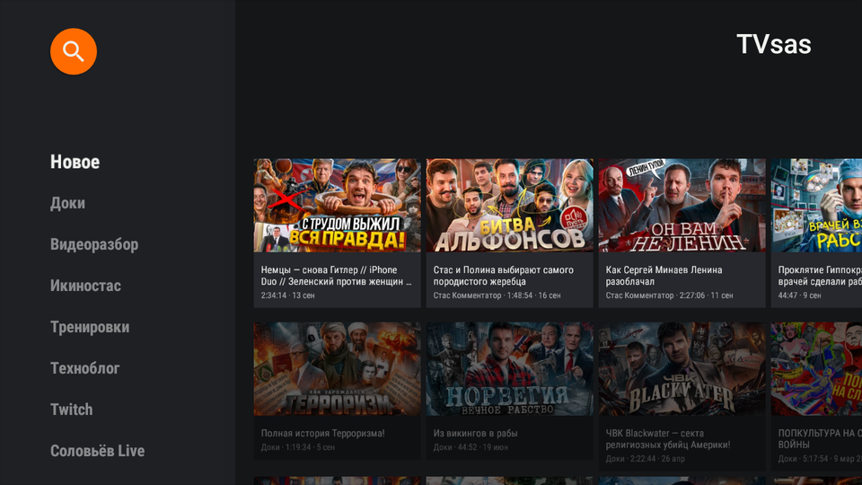

# TVsas — неофициальный клиент sasflix.ru для Android TV

Лёгкое приложение для просмотра [sasflix.ru](https://sasflix.ru) на телевизорах и приставках с Android TV.
Сделано с прицелом на **старое и слабое железо**: 32-битные приставки, 1–2 ГБ RAM, Android 5.0+.

> **Дисклеймер.** TVsas — независимый проект, не связан с авторами sasflix.ru.
> Приложение не хранит и не раздаёт видео: оно обращается к публичному API сайта
> так же, как это делает браузер. Контент по подписке доступен только после входа
> в свой аккаунт sasflix.ru с активной подпиской.



## Возможности

- Лента «Новое», строки по всем категориям сайта, полные списки с подгрузкой страниц
- Поиск (с клавиатуры пульта или голосом)
- Вход по логину/паролю от sasflix.ru — открывает видео по подписке
- Воспроизведение HLS через ExoPlayer: 240p–2160p, выбор потолка качества прямо в плеере
- «Продолжить просмотр»: позиция запоминается локально и (при входе) синхронизируется с сайтом
- Полностью управляется пультом (D-pad), интерфейс на русском

## Установка

1. Скачайте `tvsas-X.Y.Z.apk` из [Releases](../../releases/latest).
2. Поставьте на ТВ любым удобным способом:
   - **ADB:** `adb connect <ip-телевизора>` → `adb install tvsas-X.Y.Z.apk`
   - **Без ПК:** приложения Downloader / Send Files to TV / любой файловый менеджер.
     В настройках Android TV разрешите установку из неизвестных источников.
3. Иконка **TVsas** появится в лаунчере Android TV.

Требования: Android 5.0+ (API 21), устройство с Leanback (Android TV / Google TV), доступ в интернет.

## Почему работает на старом железе

| Решение | Зачем |
|---|---|
| Leanback (нативные View), без Compose | быстрый холодный старт, минимум RAM и GPU |
| Никакой рефлексии: `org.json` + OkHttp, без Retrofit/Moshi/Gson | меньше классов, R8 full-mode ужимает APK до **~1,8 МБ** |
| Coil с `RGB_565`, без hardware-bitmap'ов | вдвое меньше памяти на обложку, нет артефактов на старых GPU |
| Обложки ресайзятся на сервере (`?w=&h=&fm=webp`) | приставка не декодирует 3000×3000 JPEG |
| Строки главного экрана грузятся последовательно, а не 10 запросов разом | нет «шторма» соединений на слабом Wi-Fi чипе |
| HTTP-кэш каталога (OkHttp, 8 МБ) | повторный запуск и возврат «назад» — мгновенно |
| ExoPlayer: буфер 15–40 с, потолок 1080p по умолчанию | старые SoC не тянут 4K H.264 при 11 Мбит/с; потолок меняется в настройках |
| Только локаль `ru`, без ABI-специфичных библиотек | один универсальный APK |

Замеры на HiSilicon Hi3751V350 (Android 9, armeabi-v7a, 2 ГБ RAM): ~30 МБ PSS на главном экране, старт ≈ 1 с.

## Как это устроено

sasflix.ru работает на открытом движке [Orbita](https://github.com/bezumkin/orbita), у которого документированный REST API.
Приложение использует:

| Эндпоинт | Назначение |
|---|---|
| `GET /api/web/topics?page&limit&category_id&sort` | лента, категории |
| `GET /api/web/topics/{uuid}` | публикация (описание, список видео) |
| `GET /api/web/categories`, `GET /api/web/search?query` | категории, поиск |
| `POST /api/security/login` → `token` | вход; далее `Authorization: Bearer` |
| `GET /api/video/{uuid}?token=` | HLS master-плейлист (сегменты отдаёт S3/CDN) |
| `GET/POST /api/user/video/{uuid}` | позиция просмотра на сервере |
| `GET /api/image/{uuid}?w&h&fit=crop&fm=webp` | обложки нужного размера |

```
app/src/main/java/com/tvsas/app
├── App.kt              # Application: Prefs, OkHttp, Coil
├── data/
│   ├── Api.kt          # HTTP-клиент, кэш, URL видео/картинок
│   ├── Json.kt         # ручные мапперы JSON → модели
│   ├── Models.kt       # Topic, Category, TopicDetail, HistoryEntry…
│   └── Prefs.kt        # токен, потолок качества, история просмотра
├── ui/
│   ├── MainFragment    # BrowseSupportFragment — главный экран
│   ├── GridActivity    # VerticalGrid — категория целиком, пагинация
│   ├── DetailsActivity # карточка публикации, кнопки «Смотреть / Продолжить»
│   ├── PlayerActivity  # ExoPlayer + Leanback transport controls
│   ├── SearchActivity  # SearchSupportFragment
│   ├── LoginActivity   # GuidedStep-форма входа
│   └── SettingsActivity# качество, аккаунт, история, о приложении
└── util/Format.kt      # длительность, даты, счётчики
```

## Сборка

Нужны JDK 17 и Android SDK (платформа 36 скачается сама).

```bash
./gradlew assembleDebug            # app/build/outputs/apk/debug/app-debug.apk
./gradlew testDebugUnitTest lint   # юнит-тесты (парсинг JSON, форматирование) и lint
./gradlew assembleRelease          # минифицированный APK; без ключа подписывается debug-ключом
```

Для подписанного релиза локально: скопируйте `keystore.properties.example` → `keystore.properties` и укажите свой ключ.

## CI/CD (GitHub Actions)

| Workflow | Триггер | Что делает |
|---|---|---|
| [`ci.yml`](.github/workflows/ci.yml) | push в `main`, pull request | юнит-тесты → lint → debug APK как артефакт (14 дней) |
| [`release.yml`](.github/workflows/release.yml) | тег `vX.Y.Z` или запуск вручную | тесты → подписанный release APK → GitHub Release с автосгенерированным changelog, `SHA256SUMS.txt` и `mapping.txt` |
| [`dependabot.yml`](.github/dependabot.yml) | еженедельно | PR-ы с обновлениями Gradle-зависимостей и actions |

Версия берётся из тега: `v1.2.3` → `versionName=1.2.3`, `versionCode=10203`.

### Выпуск релиза

```bash
git tag v1.0.0
git push origin v1.0.0
```

### Секреты для подписи (Settings → Secrets → Actions)

| Секрет | Значение |
|---|---|
| `KEYSTORE_BASE64` | `base64 -w0 release.jks` |
| `KEYSTORE_PASSWORD` | пароль хранилища |
| `KEY_ALIAS` | алиас ключа (например `tvsas`) |
| `KEY_PASSWORD` | пароль ключа |

Создать ключ: `keytool -genkeypair -v -keystore release.jks -alias tvsas -keyalg RSA -keysize 2048 -validity 10000`.
Если секреты не заданы, release-сборка подписывается debug-ключом и всё равно публикуется (workflow выдаст предупреждение) —
удобно для первых тестовых релизов, но обновление поверх debug-подписи потом потребует переустановки.
